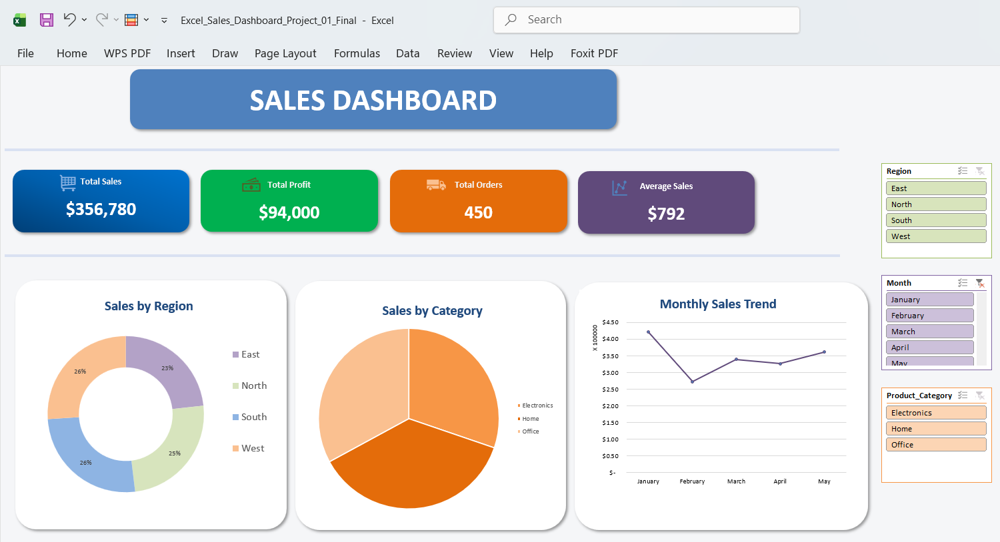

# 📊 Excel Sales Dashboard

An interactive sales dashboard created in Microsoft Excel to analyze and visualize sales performance using key metrics, PivotTables, charts, and interactive filters.

This is my first data analytics project after completing the Excel Essentials course at Macquarie University. The project allowed me to apply the Excel skills I learned to a practical sales analysis workflow.

## 🎯 Project Overview

The goal of this project was to transform sales data into an interactive and easy-to-understand dashboard.

The dashboard allows users to explore sales performance by:

- Region
- Product Category
- Month

The project demonstrates how Excel can be used to organize data, perform analysis, and communicate results through visualizations.

## 📸 Dashboard Preview



## 📈 Dashboard Highlights

The dashboard summarizes the sales data through key performance indicators:

| Metric | Result |
|---|---:|
| Total Sales | $356,780 |
| Total Profit | $94,000 |
| Total Orders | 450 |
| Average Sales | $792 |

The dashboard also includes:

- Sales by Region
- Sales by Product Category
- Monthly Sales Trend
- Interactive Region filter
- Interactive Month filter
- Product Category filter

## 🛠️ Tools & Skills

### Tools

- Microsoft Excel

### Skills Practiced

- Data preparation
- Data analysis
- PivotTables
- Pivot Charts
- Data visualization
- Dashboard design
- Interactive filters
- Sales performance analysis
- Presenting analytical results

## 🔄 Project Workflow

```text
Sales Dataset
      ↓
Data Preparation
      ↓
Data Analysis
      ↓
PivotTables
      ↓
Charts & Visualizations
      ↓
Interactive Dashboard
````

## 📂 Repository Structure

```text
excel-sales-dashboard/
│
├── Dashboard/
│   ├── sales_Dashboard.png
│   └── sales_dashboard.pdf
│
├── Excel_Files/
│   ├── Sales_Dataset.xlsx
│   └── Sales_Dashboard.xlsx
│
├── Pivot_Tables/
│   ├── Pivot_by_Region.png
│   ├── Pivot_by_Category.png
│   └── Pivot_by_Month.png
│
└── README.md
```

## 📁 Project Files

### Dashboard

The `Dashboard` folder contains:

* `sales_Dashboard.png` — dashboard preview image
* `sales_dashboard.pdf` — PDF version of the dashboard

### Excel Files

The `Excel_Files` folder contains:

* `Sales_Dataset.xlsx` — source sales dataset
* `Sales_Dashboard.xlsx` — completed Excel dashboard workbook

### Pivot Tables

The `Pivot_Tables` folder contains visual outputs of the analysis:

* `Pivot_by_Region.png`
* `Pivot_by_Category.png`
* `Pivot_by_Month.png`

## 💡 Key Learning Outcomes

Through this project, I practiced:

* Working with sales data
* Preparing data for analysis
* Creating and using PivotTables
* Creating charts from analytical results
* Building an interactive Excel dashboard
* Using filters to explore data
* Presenting information through data visualization
* Turning data into an understandable visual report

## 🎓 Learning Context

This project was created as a practical application of the skills I learned through the **Excel Essentials course at Macquarie University**.

As my first data analytics project, the main focus was learning how to take a dataset through the analysis process and present the results in a clear dashboard.

## 🚀 Future Improvements

I plan to continue developing my data analytics skills and may improve this project in the future by adding:

* More advanced Excel analysis
* Additional KPIs
* More detailed business insights
* Automated data updates
* Advanced Excel features
* A Power BI version of the analysis

## 👩‍💻 About Me

**Ayesha Tariq**

BS Data Science Student | Aspiring Data Analyst

Currently developing my skills in:

* Excel
* SQL
* Python
* Data Analysis
* Data Visualization

This project is one of the first steps in my journey toward becoming a data analyst.

## 📌 Project Status

**Completed — Beginner Data Analytics Project**

More projects will be added as I continue learning and developing my data analytics skills.
